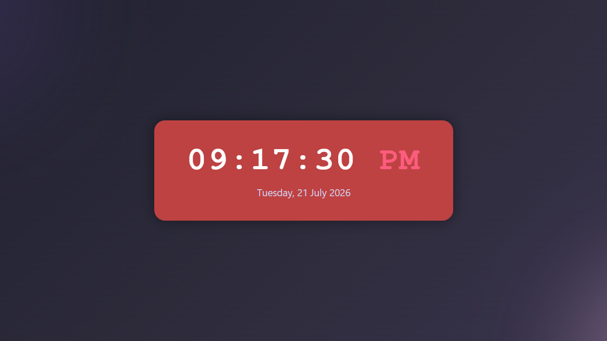
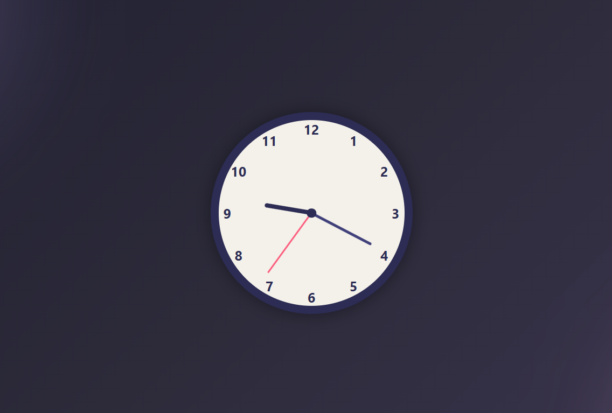

# Digital & Analog Clock

A real-time digital and analog clock built with HTML, CSS, and vanilla JavaScript. The digital clock shows the live time (12-hour format with AM/PM) and date; the analog clock renders hour, minute, and second hands that update every second.

## Features
- Live digital time display (HH:MM:SS with AM/PM) and current date
- Analog clock with smoothly moving hour, minute, and second hands
- Hand angles calculated dynamically from JavaScript's Date object
- Clean, card-style dark UI

## Tech Stack
- HTML5
- CSS3 (transforms for clock hands)
- Vanilla JavaScript (`setInterval`, `Date` object, DOM manipulation)

## How to Run
1. Clone the repo
2. Open `index.html` in any browser
   or
3. View Digital Clock: [Live Demo](https://diksha-wadekar.github.io/digital-analog-clocks/)

## Screenshots
Digital Clock:

Analog Clock:

